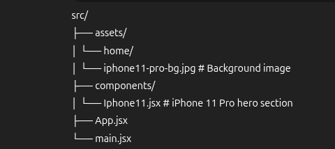

# 🍏 APPLE 2012 Landing Page

A modern **React + Tailwind CSS** landing page that showcases the **iPhone 11 Pro** with a clean design and responsive layout.

---

## 🚀 Features

- 🎨 **Tailwind CSS styling** for fast and responsive design
- 📱 **Responsive layout** across devices
- 🔗 **Call-to-action links** ("Learn more" and "Buy")
- ⚡ **Easy to customize** for other products

---

## 🛠️ Tech Stack

- [React](https://react.dev/) – Frontend framework
- [Tailwind CSS](https://tailwindcss.com/) – Utility-first CSS framework
- [Vite](https://vitejs.dev/) – Build tool & dev server

---

## 📂 Project Structure



---

## ⚙️ Installation & Setup

1. **Clone the repo:**
   ```bash
   origin  git@github.com:NatnaelAbWe/Apple-2012-clone.git
   cd apple-2012
   ```
2. **Install dependencies**

```bash
npm install
```

3. **Run the development server:**

```bash
npm run dev
```

4. **Open in browser:**

```bash
http://localhost:5173
```

---

## 📜 License

This project is licensed under the MIT License – feel free to use and modify it.

---

## 🙌 Contributing

Pull requests are welcome! For major changes, please open an issue first to discuss what you’d like to change.

---
